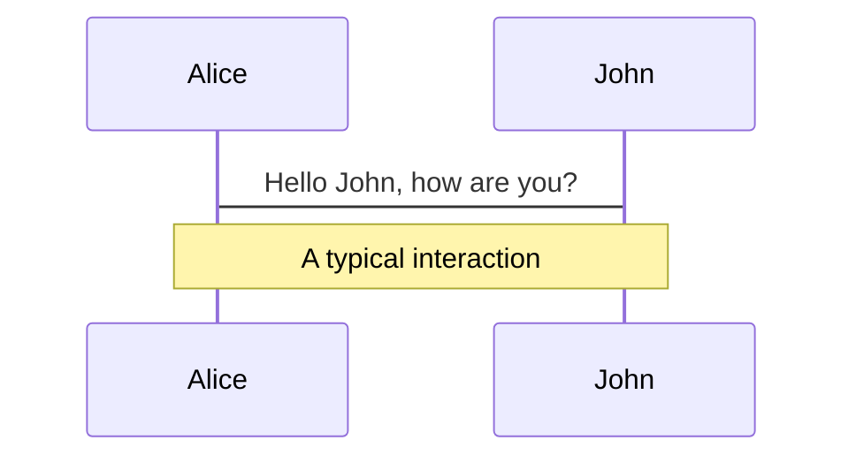
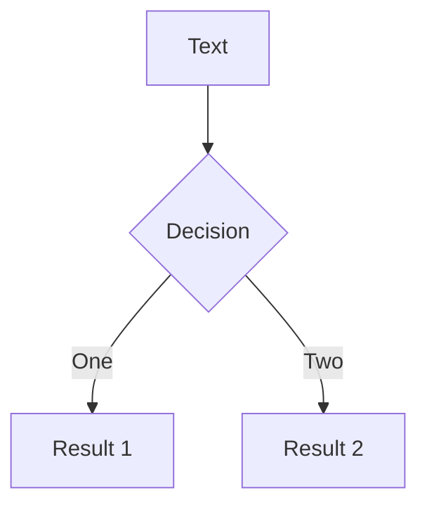
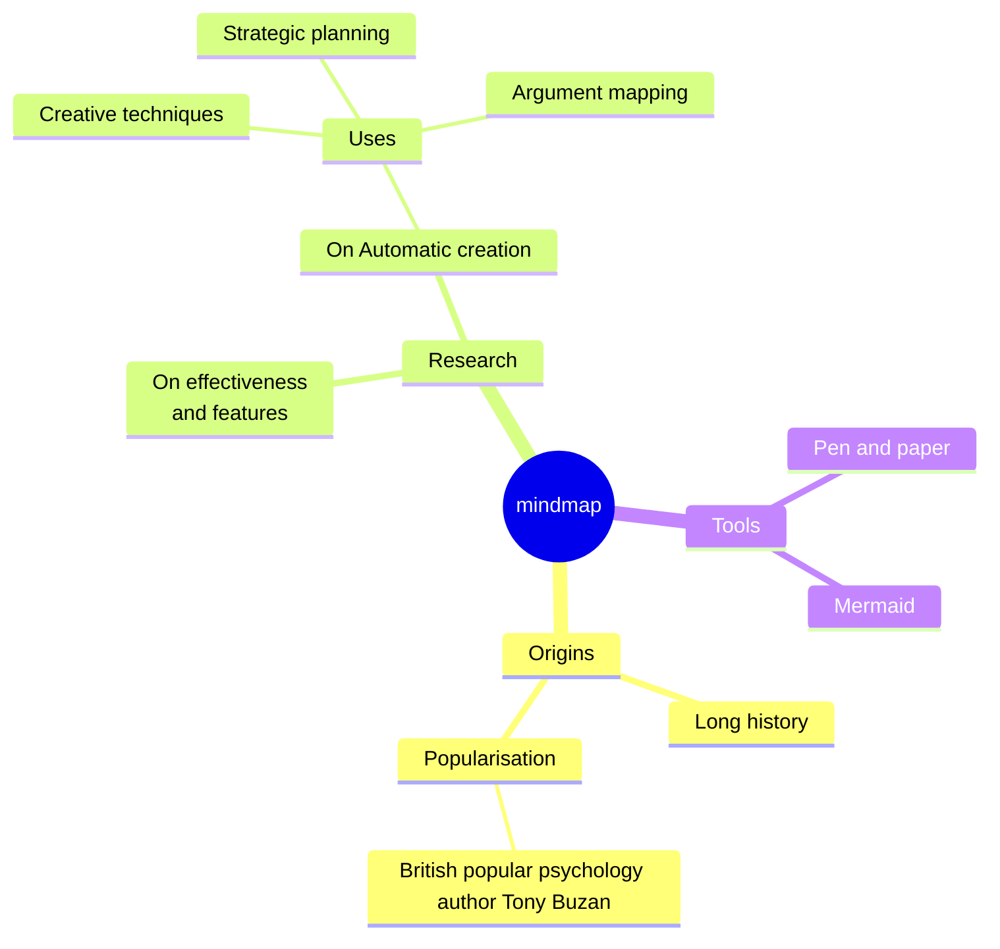
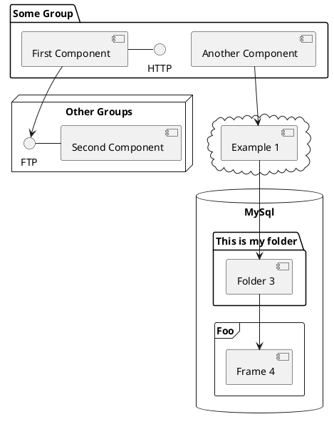

---
# You can also start simply with 'default'
theme: seriph
# random image from a curated Unsplash collection by Anthony
# like them? see https://unsplash.com/collections/94734566/slidev
background: https://cover.sli.dev
# some information about your slides (markdown enabled)
title: Alan J. Perlis
info: |
  ## Slidev Starter Template
  Presentation slides for developers.

  Learn more at [Sli.dev](https://sli.dev)
# apply unocss classes to the current slide
class: text-center
# https://sli.dev/features/drawing
drawings:
  persist: false
# slide transition: https://sli.dev/guide/animations.html#slide-transitions
transition: slide-left
# enable MDC Syntax: https://sli.dev/features/mdc
mdc: true
# open graph
# seoMeta:
#  ogImage: https://cover.sli.dev
---

# Alan Jay PERLIS

Turing Awards №1, 1966

<div @click="$slidev.nav.next" class="mt-12 py-1" hover:bg="white op-10">
  Feat <a href="https://sli.dev/">slidev</a>, click click here <carbon:arrow-right class="pt-1" />
</div>

<div class="abs-br m-6 text-xl">
  <a href="https://github.com/ltruchot/loic-truchot-dev-workspace/blob/main/packages/turing-awards/slides.md" target="_blank" class="slidev-icon-btn">
    <carbon:logo-github />
  </a>
</div>

<!--
The last comment block of each slide will be treated as slide notes. It will be visible and editable in Presenter Mode along with the slide. [Read more in the docs](https://sli.dev/guide/syntax.html#notes)
-->

---
transition: fade-out
---

# Qu’est-ce que le prix Turing ?

Plus haute distinction en informatique, considéré comme le "Nobel de l'informatique" en l'honneur d'Alan Turing

- 🏆 **Pourquoi**: Récompense contributions exceptionnelles et durables à l'informatique 
- 🧠 **Qui**: Association for Computing Machinery (ACM), New York City
  - 100 000 membres
  - principales revues scientifiques CS: JACM, CSUR, TOPLAS
  - grandes conf académiques CS: SIGCOMM, SIGGRAPH, SIGARCH
- 📅 **Quand**: Tous les ans depuis 1966, souvent en juin
- 🌍 **Où**: Cérémonie annuelle dans différentes villes importantes
  - 2023 à Wuhan, Chine
  - 2024 à New York, USA
- 1️⃣ **Premier lauréat**: Alan J. Perlis (1966) - Contributions aux bases de la programmation avancée
- 🥇 **Derniers**: Andrew G. Barto et Richard S. Sutton (2024) - Apprentissage par renforcement
- 💰 **Bonus**: 1 million de dollars américains

<br>
<br>

Intégrale des [Turing Lectures](https://amturing.acm.org/lectures.cfm)

<!--
You can have `style` tag in markdown to override the style for the current page.
Learn more: https://sli.dev/features/slide-scope-style
-->

<style>
h1 {
  background-color: #2B90B6;
  background-image: linear-gradient(45deg, #4EC5D4 10%, #146b8c 20%);
  background-size: 100%;
  -webkit-background-clip: text;
  -moz-background-clip: text;
  -webkit-text-fill-color: transparent;
  -moz-text-fill-color: transparent;
}
</style>


---
transition: slide-up
layout: two-cols
layoutClass: gap-16
---

# Sommaire

Perlis: sa vie, son oeuvres, ses bons mots

::left::

toto 

::right::

<Toc text-sm minDepth="1" maxDepth="3" />

---
layout: image-right
image: ./assets/alan_perlis.webp
---

# Biograhie

ALAN J. PERLIS (1922-1990)

<div class="flex flex-wrap items-start gap-3">
  <style>
    img {
      max-width: 150px;
      flex: 0 0 auto;
    }
  </style>
  
  
  
  

</div>


---
level: 2
transition: slide-up
---

# FORMATION ET PARCOURS INITIAL

La guerre, toujours la guerre  

* 👶 Naissance 1er avril 1922 à Pittsburgh Pennsylvanie
* 🧪 Licence chimie Carnegie Institute Technology 1943
* ✈️ Lieutenant météorologue forces aériennes pendant guerre mondiale
* 🎓 Master et PhD mathématiques MIT 1949-1950 - itération et recursion
* 🔢 Découverte informatique via calculs balistiques après guerre


---
level: 2
transition: slide-up
---
# INNOVATIONS EN PROGRAMMATION (1951-1965)

Contributions fondamentales  

* 🖥️ Travaux sur ENIAC - premier ordinateur électronique
* 🛠️ Développement Internal Translator (IT) 1956 - premier compilateur
* 🌐 Co-créateur ALGOL-60 - premier langage indépendant des machines
* 📦 Introduction concepts blocs code et variables locales
* 👑 Président Association for Computing Machinery (ACM) 1962-1964

---
level: 3
---

# ENIAC

Electronic Numerical Integrator And Computer


---
level: 3
---

# ALGOL-60

Oui, mais avec modération.

Featuring [jff-algol](https://github.com/JvanKatwijk/algol-60-compiler): A simple ALGOL 60 to C translator


````md magic-move {lines: true}
```c {*|2|*}
BEGIN
  FILE F(KIND=REMOTE);
  EBCDIC ARRAY E[0:11];
  REPLACE E BY "HELLO WORLD";
  WRITE(F, *, E);
END.
```

--> real world "hello world"
--> https://fr.wikipedia.org/wiki/Suite_de_Fibonacci
--> average ?


---
level: 2
transition: slide-up
---

# HÉRITAGE ET RECONNAISSANCE (1966-1990)

Influence durable  

* 🏆 Premier lauréat Prix Turing 1966 - deux ans après fin présidence ACM
  * __for his influence in the area of advanced programming techniques and compiler construction__
* 🏫 Professeur Yale University 1971-1990 - chaire Eugene Higgins
* 💻 Grand défenseur langage APL - "plus français qu'anglais" selon lui
* 📜 Publication "Epigrams on Programming" 1982 - principes toujours cités
* 🔍 Formalisation science informatique comme discipline académique indépendante


<!--
Notes can also sync with clicks

[click] This will be highlighted after the first click

[click] Highlighted with `count = ref(0)`

[click:3] Last click (skip two clicks)
-->


# APL

<div grid="~ cols-2 gap-4">
<div>

You can use Vue components directly inside your slides.

We have provided a few built-in components like `<Tweet/>` and `<Youtube/>` that you can use directly. And adding your custom components is also super easy.

```html
<Counter :count="10" />
```

<!-- ./components/Counter.vue -->
<Counter :count="10" m="t-4" />

Check out [the guides](https://sli.dev/builtin/components.html) for more.

</div>
<div>

```html
<Tweet id="1390115482657726468" />
```

<Tweet id="1390115482657726468" scale="0.65" />

</div>
</div>

<!--
Presenter note with **bold**, *italic*, and ~~striked~~ text.

Also, HTML elements are valid:
<div class="flex w-full">
  <span style="flex-grow: 1;">Left content</span>
  <span>Right content</span>
</div>
-->

---
class: px-20
---

# Citations

Slidev comes with powerful theming support. Themes can provide styles, layouts, components, or even configurations for tools. Switching between themes by just **one edit** in your frontmatter:

<div grid="~ cols-2 gap-2" m="t-2">

```yaml
---
theme: default
---
```

```yaml
---
theme: seriph
---
```


</div>

Read more about [How to use a theme](https://sli.dev/guide/theme-addon#use-theme) and
check out the [Awesome Themes Gallery](https://sli.dev/resources/theme-gallery).

---

# Clicks Animations

You can add `v-click` to elements to add a click animation.

<div v-click>

This shows up when you click the slide:

```html
<div v-click>This shows up when you click the slide.</div>
```

</div>

<br>

<v-click>

The <span v-mark.red="3"><code>v-mark</code> directive</span>
also allows you to add
<span v-mark.circle.orange="4">inline marks</span>
, powered by [Rough Notation](https://roughnotation.com/):

```html
<span v-mark.underline.orange>inline markers</span>
```

</v-click>

<div mt-20 v-click>

[Learn more](https://sli.dev/guide/animations#click-animation)

</div>

---

# Motions

Motion animations are powered by [@vueuse/motion](https://motion.vueuse.org/), triggered by `v-motion` directive.

```html
<div
  v-motion
  :initial="{ x: -80 }"
  :enter="{ x: 0 }"
  :click-3="{ x: 80 }"
  :leave="{ x: 1000 }"
>
  Slidev
</div>
```

<div class="w-60 relative">
  <div class="relative w-40 h-40">
    
    
    
  </div>

  <div
    class="text-5xl absolute top-14 left-40 text-[#2B90B6] -z-1"
    v-motion
    :initial="{ x: -80, opacity: 0}"
    :enter="{ x: 0, opacity: 1, transition: { delay: 2000, duration: 1000 } }">
    Slidev
  </div>
</div>

<!-- vue script setup scripts can be directly used in markdown, and will only affects current page -->
<script setup lang="ts">
const final = {
  x: 0,
  y: 0,
  rotate: 0,
  scale: 1,
  transition: {
    type: 'spring',
    damping: 10,
    stiffness: 20,
    mass: 2
  }
}
</script>

<div
  v-motion
  :initial="{ x:35, y: 30, opacity: 0}"
  :enter="{ y: 0, opacity: 1, transition: { delay: 3500 } }">

[Learn more](https://sli.dev/guide/animations.html#motion)

</div>

---

# LaTeX

LaTeX is supported out-of-box. Powered by [KaTeX](https://katex.org/).

<div h-3 />

Inline $\sqrt{3x-1}+(1+x)^2$

Block
$$ {1|3|all}
\begin{aligned}
\nabla \cdot \vec{E} &= \frac{\rho}{\varepsilon_0} \\
\nabla \cdot \vec{B} &= 0 \\
\nabla \times \vec{E} &= -\frac{\partial\vec{B}}{\partial t} \\
\nabla \times \vec{B} &= \mu_0\vec{J} + \mu_0\varepsilon_0\frac{\partial\vec{E}}{\partial t}
\end{aligned}
$$

[Learn more](https://sli.dev/features/latex)

---

# Diagrams

You can create diagrams / graphs from textual descriptions, directly in your Markdown.

<div class="grid grid-cols-4 gap-5 pt-4 -mb-6">









</div>

Learn more: [Mermaid Diagrams](https://sli.dev/features/mermaid) and [PlantUML Diagrams](https://sli.dev/features/plantuml)

---
foo: bar
dragPos:
  square: -62,0,0,0
---

# Draggable Elements

Double-click on the draggable elements to edit their positions.

<br>

###### Directive Usage

```md

```

<br>

###### Component Usage

```md
<v-drag text-3xl>
  <div class="i-carbon:arrow-up" />
  Use the `v-drag` component to have a draggable container!
</v-drag>
```

<v-drag pos="663,206,261,_,-15">
  <div text-center text-3xl border border-main rounded>
    Double-click me!
  </div>
</v-drag>


###### Draggable Arrow

```md
<v-drag-arrow two-way />
```

<v-drag-arrow pos="67,452,253,46" two-way op70 />

---
src: ./pages/imported-slides.md
hide: false
---

---

# Monaco Editor

Slidev provides built-in Monaco Editor support.

Add `{monaco}` to the code block to turn it into an editor:

```ts {monaco}
import { ref } from 'vue'
import { emptyArray } from './external'

const arr = ref(emptyArray(10))
```

Use `{monaco-run}` to create an editor that can execute the code directly in the slide:

```ts {monaco-run}
import { version } from 'vue'
import { emptyArray, sayHello } from './external'

sayHello()
console.log(`vue ${version}`)
console.log(emptyArray<number>(10).reduce(fib => [...fib, fib.at(-1)! + fib.at(-2)!], [1, 1]))
```

---
layout: center
class: text-center
---

# Learn More

[Documentation](https://sli.dev) · [GitHub](https://github.com/slidevjs/slidev) · [Showcases](https://sli.dev/resources/showcases)

<PoweredBySlidev mt-10 />
